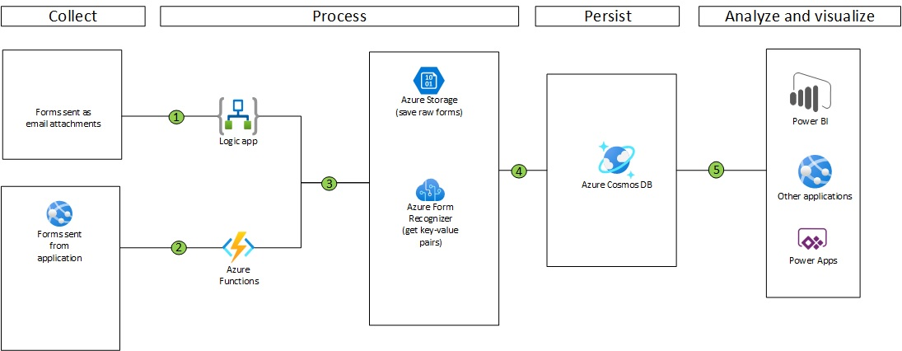

# Automated document processing for  organizations with paper-based forms(ASP.net MVC and Function CORE .NET)

This reference architecture shows how to deploy an end-to-end form admissions form information extraction pipeline. It uses a browser page for file/image ingestion, Application Gateway for traffic balancing, Azure Data Lake Storage to store the images, Event Grid for event-based triggering, Azure Functions for serverless invocations, Azure Form Recognizer pre-built General Document API Model (for this solution accelerator, could leverage custom-built model if needed) & CosmosDB to store the results. The SaaS app integration is left out, as this would be case-specific. (PLACEHOLDER FOR POWERBI VISUALIZATION IF WE WANT). 

## Deploy

Before you hit the deploy button, make sure you review the details about the services deployed.

Deploy to Azure Commericial

Deploy to Azure Commericial

Deploy to Azure Government  

Once the resource deployed, you will need to deploy the functions to the Function App (at this time - could be further automated).

> **Important:** This deployment accelerator implements some service features that are still in Public Preview. Please consider those before you plan for a production deployment.
